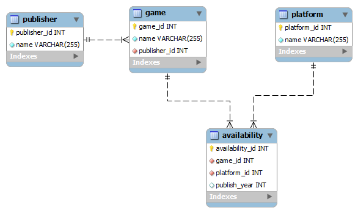

# Computer Science I
## Lab 15.0 - Databases


This is a lab used in Computer Science I (CSCE 155E, CSCE 155H) in the 
[Department of Computer Science & Engineering](https://cse.unl.edu) at the 
[University of Nebraska-Lincoln](https://unl.edu).

## 1. Overview 

### Prior to Lab

Before attending this lab:

1.  Read and familiarize yourself with this handout.

### Peer Programming Pair-Up

**For students in the online section:** you may complete the lab on your
own if you wish or you may team up with a partner of your choosing.  You
may consult with a lab instructor to get teamed up online (via Zoom).

**For students in the face-to-face section:** your lab instructor will
team you up with a partner.

To encourage collaboration and a team environment, labs are be
structured in a *peer programming* setup. At the start of each lab, you
will be randomly paired up with another student (conflicts such as
absences will be dealt with by the lab instructor). One of you will be
designated the *driver* and the other the *navigator*.

The navigator will be responsible for reading the instructions and
telling the driver what to do next. The driver will be in charge of the
keyboard and workstation. Both driver and navigator are responsible for
suggesting fixes and solutions together. Neither the navigator nor the
driver is "in charge." Beyond your immediate pairing, you are encouraged
to help and interact and with other pairs in the lab.

Each week you should alternate: if you were a driver last week, be a
navigator next, etc. Resolve any issues (you were both drivers last
week) within your pair. Ask the lab instructor to resolve issues only
when you cannot come to a consensus.

Because of the peer programming setup of labs, it is absolutely
essential that you complete any pre-lab activities and familiarize
yourself with the handouts prior to coming to lab. Failure to do so will
negatively impact your ability to collaborate and work with others which
may mean that you will not be able to complete the lab.

### Lab Objectives & Topics

At the end of this lab you should be familiar with the following

-   Have an understanding of relational database systems (tables, keys,
    foreign keys)

-   Have some understanding of how databases are used in a larger
    application

-   Have some exposure to database connectivity programming using the
    Open DataBase Connectivity (ODBC) API
    
## 2. Background

### 2.1 Databases

Many applications require that data be *persistent* by storing it in a
relational database management system (RDBM). Relational databases offer
a lot of features, in particular the ability to define relationships
between data. Data is generally stored in tables which have columns
(fields) and rows (individual records). Uniqueness of records is defined
by using primary keys while relations between records in different
tables are defined using foreign keys.

To illustrate these relations, consider the following entity-relation
(ER) diagram of a small database that models data related to video
games.
 
<p align="center">

</p>

In this database there are four tables representing three
entities: games, publishers, and platforms. Each of these tables has
various columns as indicated: unique IDs, names, etc. The arrows between
each table indicate a relation between the records in each of those
tables.

The relation between a publisher and games is a one-to-many
relationship; modeling that a single publisher can publish many games,
but that any one game is published by only a single publisher.

The relation between a game and a platform is a bit more complex. One
game could be available on multiple platforms (PC, X-Box, etc.) and one
platform certainly has many different games for it. This is known as a
many-to-many relationship and is defined by use of a join table:
`availability` which contains foreign keys to both the game and platform
tables. The availability table also contains one piece of additional
information: the year that a particular game was published for a
particular platform.

This is a well-designed database with well-defined relationships between
data records. Data is not duplicated as it would be if we stored all of
this information in a flat file. The integrity of the data is
enforced by its design:

-   A publisher can exist independent of any game or platform records in
    our database.

-   However, a game cannot exist without a publisher.  The proper
    publisher record must be present in the database before we can
    insert a game and we must make a proper reference back to the proper
    publisher record (through the use of foreign and primary keys).

-   A platform and a game can exist independent of each other. It is
    only when we insert a record into the availability table that those
    records are brought together and a relationship is defined. However,
    the game and platform records need to exist before we can define
    that relation.

We will not go into the details of how this database was designed, built
and implemented using SQL (Structured Query Language). Instead, the
focus of this lab will be to use an API (Application Programmer
Interface) that we've built for you.

### 2.2 ODBC and the Database API

An RDMS is used for the storage of data. There are many vendors and
database systems available (MSSQL, MySQL, PostgreSQL, Oracle, etc.).
Some of these are free and open source, others are "freeware" and others
can cost millions of dollars. If programs were written specifically to
connect to only one of these databases, then we would need to rewrite
the application if we ever wanted to migrate to a different RDMS (if we
wanted to move to a cheaper alternative or if we needed to scale our
application up to a larger, faster database system).

Instead, applications are usually written on top of an abstract data
access layer API which defines a general interface for interacting with
a database. Venders (Oracle, Microsoft) then publish drivers for these
that provide specialized behavior for specific database systems. The API
that we'll be using for this lab is ODBC (Open DataBase Connectivity).
ODBC defines structures and functions that can be used to connect to a
database, formulate queries (to insert, update, delete and select data)
and process the results. The details are beyond the scope of this
lab.  Instead, we have developed a small API that allows you to insert and
retrieve data from the Video Game database described above.

## 3. Activities

### 3.1 Getting Started
Clone the project code for this lab from GitHub using the following URL:
<https://github.com/cbourke/CSCE155-C-Lab15>.

### 3.2 Viewing the Data

Included in the project code are several source files that provide basic
database functionality and definitions of structures that model games,
publishers, and platforms. Also included is a `makefile` to build all
of the code.

#### Instructions

1.  Open the `databaseInfo.h` header file and fill in values 
    for the `database`, `userId`, and `password` variables. 
    These credentials will be provided by your lab instructor.

2.  Open the `listGames.c` source file and examine at the code. 
    Build this program by executing the following from the 
    command line: `make listGames`

3.  Run the demo that was built for you, `./listGames` and 
    observe the results. We'll reuse this program later, 
    so don't make any changes to `listGames.c`.

4.  Now look at the source code contained in `game.c` and 
    answer the questions in your worksheet.

### 3.3 Inserting New Records

In this activity, you will use our API to add your favorite video game
to the database. Note: every student in this lab (and in the other labs
for this course) is working on the same database. It is not likely that
any individual student could break the database, but you should be aware
that inserting the same video game/publisher/platform for which a record
already exists will have no effect. Though you are encouraged to enter
your favorite game, if it is popular enough, someone else may have
already inserted it. If adding a game fails, try again with another
title (you may make one up if you need to).

#### Instructions

Edit the `insertGame.c` source file and add code to add your favorite 
game to the database using our API. To properly insert a new video 
game you need its name, the name of its publisher, at least one 
platform that it has been published on and its published year.

1.  Use the `getGame` function to see if the game already exists. 
    This function returns a `VideoGame` structure pointer 
    corresponding to the game if exists and `NULL` if it is not
    already in the database.  If the game already exists you should
    end the program program and rerun it with another game or a 
    renamed game as described above.

2.  Use the `getPlatform` and `getPublisher` functions to find 
    records (if they exist) for the platform and publisher of 
    your game. If records do not exist (the functions return `NULL`) 
    then use the `addPlatform` and `addPublisher` functions to 
    add them first.

3.  Compile your program using `make insertGame` and run it using
    `./insertGame`

4.  Run the `listGames` program from before to verify that your 
    program worked.

### 3.4 Ensuring Data Integrity

Relational databases are intended to enforce constraints and ensure good
data integrity. In this activity you'll see what happens when those
constraints are violated.

1.  Attempt to add a game with an invalid publisher id and see what
    error(s) result. To do this, add the following to the end of your
    `insertGame.c` program ***but do not include it in your submitted
    version!***
    ```c
    addVideoGame("Pac Man's Revenge", 12345678, sqlstatementhandle);
    extractError("", sqlstatementhandle, SQL_HANDLE_STMT);        
    ```

2.  Run the program and answer the questions on your worksheet.

Handin/Grader Instructions
==========================

1.  Hand in your completed files:

    - `insertGame.c` 
    - `worksheet.md`  

    through the webhandin (<https://cse-apps.unl.edu/handin>) using your
    cse login and password.

2.  Even if you worked with a partner, you *both* should turn in all
    files.

3.  Verify your program by grading yourself through the webgrader
    (<https://cse.unl.edu/~cse155e/grade/>) using the same credentials.

4.  Recall that both expected output and your program's output will be
    displayed. The formatting may differ slightly which is fine. As long
    as your program successfully compiles, runs and outputs the *same
    values*, it is considered correct.

## Advanced Activity (Optional)

Contrast the code in the and functions. The function uses what is known
as a prepared statement: a statement that has parameters (denoted with a
question mark) and uses the API to prepare the statement and set those
parameters. The function does not use parameters, but directly places
the value of each column directly into the string. Prepared statements
are the preferred way of doing database queries especially with
applications that accept data entered by users. Unprepared statements
are susceptible to SQL Injection Attacks where a malicious user can
inject their own SQL statements into the application's database calls
and execute unauthorized SQL statements on the database. Review the
example and the documentation for ODBC and change the statements in the
and functions to prepared statements.
